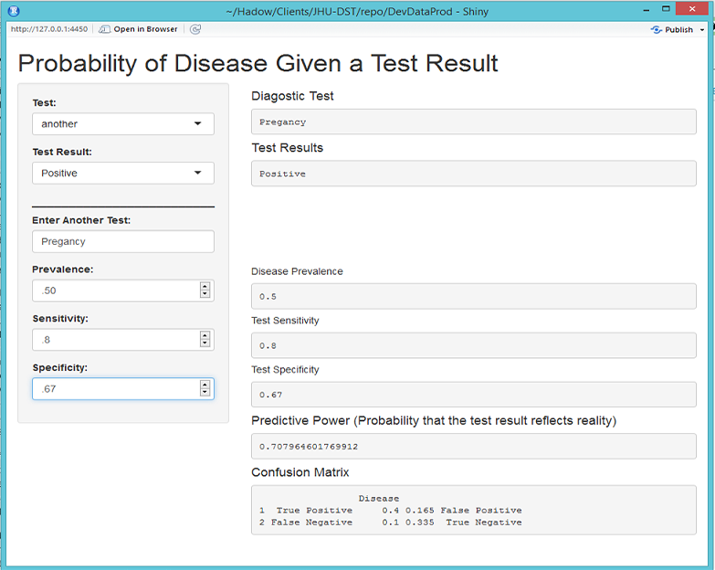

## Should I trust my e.p.t. or HIV test?

We built a simple two-dropdown interface for users to evaluate the practical meaning of medical tests. It has hover help.



```{r preprocess, echo=FALSE}

figDir <- "figures/"
opts_chunk$set(fig.path = figDir)

if(!file.exists("tree")) dir.create("tree")
if(!file.exists("tree/gh-pages")) dir.create("tree/gh-pages")
reactive <- function(x) x  # for demo pruposes only

test <- c("Mammogram","PSA","HIV")
prev <- c(0.01,.01,.003)
sens <- c(.678,.631, .95)
spec <- c(.75,.349,.95)
test <- data.frame(test, prev, sens, spec, stringsAsFactors = FALSE)
rm(prev, sens, spec)

input <- output  <- test[1,]
colnames(output) <- c("uote", "uopr", "uose", "uosp")
colnames(input)  <- c("uite", "uipr", "uise", "uisp")
      
```
        


--- 

## We built a straighforward, boring, text-only interface to calculate positive and negative predictive values of diagnostic tests.  For three common tests, mammography, HIV and PSA, the interface asks only two questions:

* Test
* Result  

For interested users, the input area expands, allowing an input of specific factors.

* Prevalence of Condition
* Test Sensitivity
* Test Specificity

--- 

## Behind the scenes, we used R to solve a system of simultaneous linear equations quite painlessly
$A*x=b$


$$\begin{equation*}
\mathbf{A} = \left(
\begin{array}{ccc}
1 & 1 & 1 & 1 \\
Prev-1 & Prev & Prev-1 & Prev \\
Sens-1 & 0 & Sens & 0 \\
0 & Spec & 0 & Spec-1  \\
\end{array} \right)
\end{equation*}$$


$$\begin{equation*}
\mathbf{b} = \left(
\begin{array}{ccc}
1 \\
0 \\
0 \\
0 \\
\end{array} \right)
\end{equation*}$$


In R, the command is simple:  $$x \leftarrow solve(A,b)$$


--- 

## See the whole slidify page here: [Home Medical Tests] (http://www.w3schools.com)

Here is one nifty piece of code that allows you to pull data from other sources without writing a separate function. This one can pull from a datastore or user input.

In this case, we simulate user selection of _Mammogram_, whose data already resides in the _test_ object. We pull the prevalence statistic. If the test were not to be found, it would use the user supplied value for prevalence.

```{r inline_pull}

input$uite = "Mammogram"

output$uopr <- reactive({ifelse(input$uite == "another", input$uipr,
                test[input$uite == test$test, "prev"])})

output$uopr   # display the prevalence of breast cancer in the general population

```


--- 

## Lessons Learned and Opportunities for Development

Shiny requires strict attention to compartmentalizing most data manipulation activity **outside** the shinyServer anonymous function.  Concentrate on data presentation in this code block.  

Efficient operation of _server.R_ requires logical design.  Troubleshooting _ui.R_ requires wrangling lots of brackets and commas. 

The **conditionalPanel** command is very useful for managing screen-space.  Hover help also helps a clean appearance. 

The design could be expanded to capture user-entered data and to provide confidence intervals for these measures.

